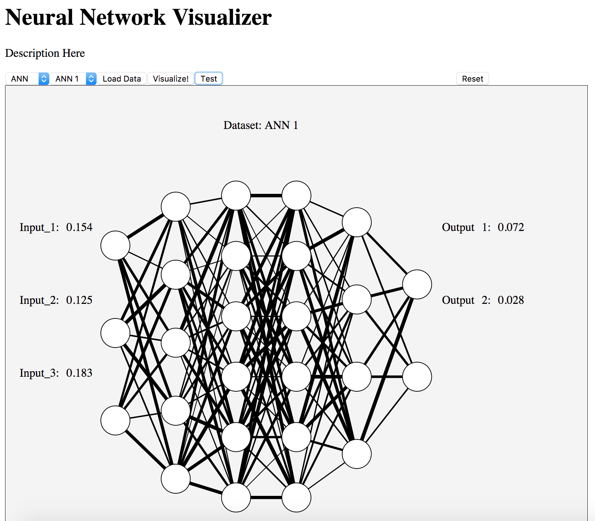
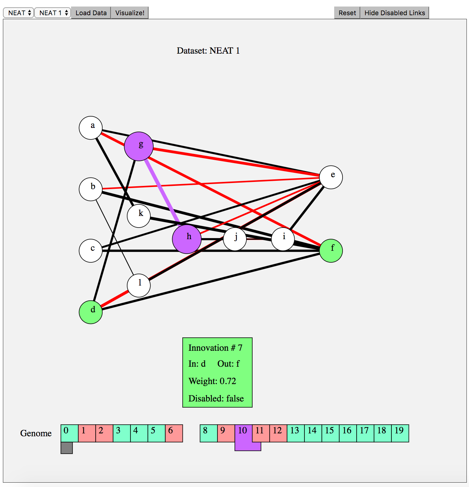
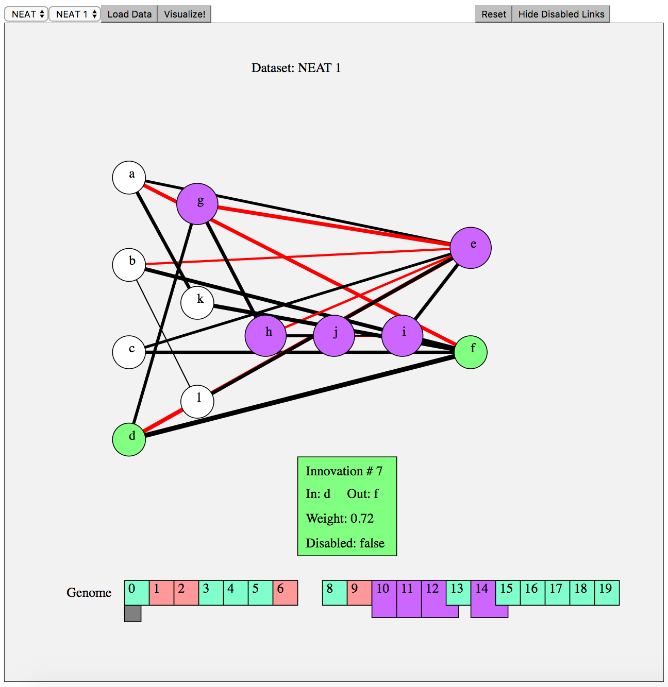

# NetworkVisualization
The network visualization tool is currently capable of providing a rudimentary visualization of general Artificial Neural Networks (ANNs) and networks generated via the Neuroevolution of Agumenting Topology (NEAT) genetic algorithm.

Currently, the tool has a data simulator `dataSimulator.js` wherein ANN and NEAT data sets are randomly generated. Later, the tool will directly interface with live networks and visualize them at time steps of interest or dynamically in real time.

To use the tool, select your model of interest (NEAT or ANN), and select a randomly generated dataset. Click `load` to load the dataset into the app, and then click `visualization` to generate the network visualization.

## ANN Visualization
The ANN visualization is currently setup to send a randomly generated input feature vector (of appropriate dimension) to the network, feedforward, and generate an output based upon the ANN topology and weights. The input and output values are presented on the canvas. Press the `test` button to see this functionality. *Note*: This feature is not currently enabled for NEAT.

Mouseover the links will console log the weights.

</img>

## NEAT Visualization
In NEAT, a genetic encoding is utilized to capture the network generated during evolution. Each organism in the evolution contains a genome. Each genome is a linear sequence of genes. The gene corresponds to the links in the network. Each gene has an innovation number (utilized for tracking evolutionary history, useful for speciation, crossover, etc.), the two neurons (input and output) that the gene connects, the weight of the connection, and an enable state that indicates whether or not the gene is active in the network.

The red-colored links in the visualization indicate the disabled genes, both in the network representation and in the genome representation. The weights are scaled such that the bigger positive weighted genes have a bigger stroke width, whereas the larger negative weighted genes have a smaller stroke width.

</img>

Mouseover the genes pops out the gene and highlights the related link and nodes in the network visualization. Conversely, mouseover a link in the neural network visualization will highlight the respective network elements as well as highlight and popout the respective gene in the genome. Clicking on the gene or the link will fully open the gene in the genome, displaying information about the weight, its connecting nodes, innovation number, etc. Mouseover of a node will highlight all nodes that are connected to it via both enabled and disabled links. Lastly, the disabled links can be hidden by clicking the button in the top right of the visualization. Hiding the nodes enables the network visualization of the final state of the network in the evolutionary sequence.

</img>
